# GBA Vulnerable Groups Cross-Regional Employment Empowerment Platform

An AI-assisted employment empowerment platform for vulnerable job seekers in the Greater Bay Area (GBA): it turns unstructured experience into a structured profile, supports mock interview practice and lightweight upskilling, and surfaces inclusive roles through skill-first matching—without putting generative AI behind a mandatory paywall for those who need it most.

## Background and Goals

Cross-border employment support in the GBA faces a dual gap in **capability** and **access**. Elderly migrant workers, job seekers with disabilities, and people with career breaks often need continuous, low-threshold help—structuring transferable experience, aligning to inclusive vacancies, practising verbal answers, and planning short study blocks—rather than one-shot resume templates or opaque ranking scores. Mainstream products typically keep free tiers at keyword search, while generative aids sit behind subscriptions.

This platform aims to close that gap with:

- Three individual AI journeys (smart resume, interactive mock interview, skill-gap learning path) sharing one structured candidate–JD context
- Rule-based skill-first job matching with inclusive hard filters
- Donation-gated Premium for corporates and non-vulnerable unlocks, while **vulnerable individual accounts receive free full AI access**
- Auditable business rules for auth, donations, posting, match scores, and access flags (AI assists; it does not replace the hiring oracle)

**Feature boundary (authoritative in Chapter 6):** Class **A** capabilities below are production-shipped. Class **B** items (OCR, embedding/RAG, curated learning-resource LLM, Hunyuan translate UI) are config-reserved and currently disabled. Class **C** items (end-to-end anonymised blind screening, community shells) are not production-wired.

## Features

- **Smart Resume Generator** — Upload PDF/DOCX/TXT/Markdown or paste text; extract a structured profile; clarify gaps; stream modular resume generation; polish modules in place; export PDF/DOCX/HTML. Output language follows the uploaded material (primarily Chinese or English).
- **AI Mock Interview** — Question banks, custom questions, and interactive programmes (Quick / Full / Specialized) with turn feedback, debrief, and save/reload for logged-in users.
- **Skill Learning Path** — Gap diagnosis plus an editable study timeline derived from daily available hours (resource cards remain disabled).
- **Skill-first job matching** — Node soft scores emphasise skill overlap; inclusive hard filters apply when employers opt in; no demographic soft penalties.
- **Access model** — Vulnerable individuals: free full access. Non-vulnerable individuals: unlock AI tools via voluntary donation. Corporates: free baseline recruitment; Premium HR kits and analytics after donation.

## Tech Architecture and Decisions

The stack has three layers:

1. **LLM foundation** — SiliconFlow OpenAI-compatible APIs via LangChain `ChatOpenAI`, with JSON-schema helpers, language guards, and an optional Redis LLM queue.
2. **Agent middle layer** — LangGraph `StateGraph` over shared Redis `CopilotState` (planner + specialised agents). Long-running work (resume SSE, interactive mock interview REST) runs **outside** the single chat path but still shares session state.
3. **Platform interface** — FastAPI for AI routes; Express/Node for auth, donations, access flags, jobs, applications, and `scoreJobResume`; separate individual and corporate portals.

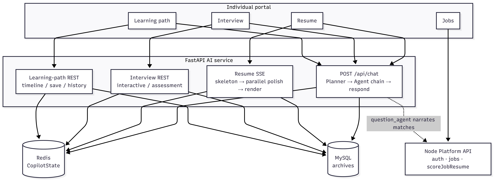

*Figure C-1. Overall AI architecture and data flow.*

Subsystem flows:

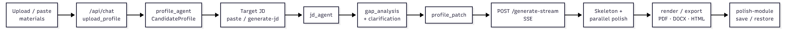

*Figure C-2. Smart resume generation flow.*

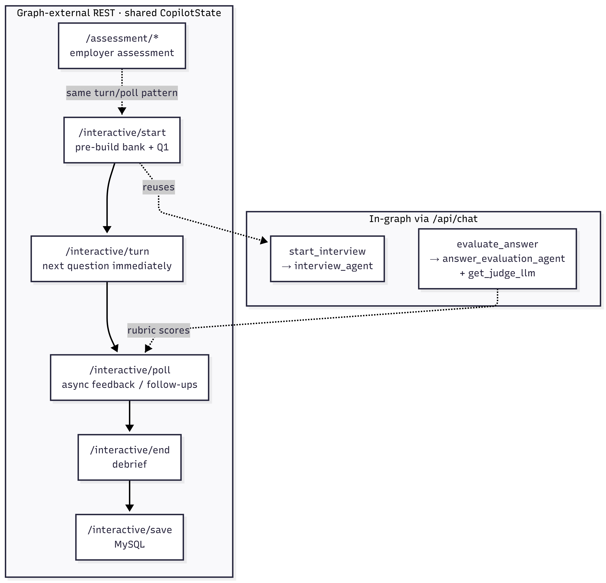

*Figure C-3. AI mock interview flow.*

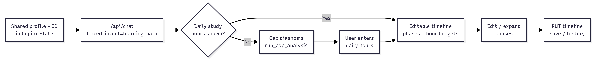

*Figure C-4. Skill learning-path flow.*

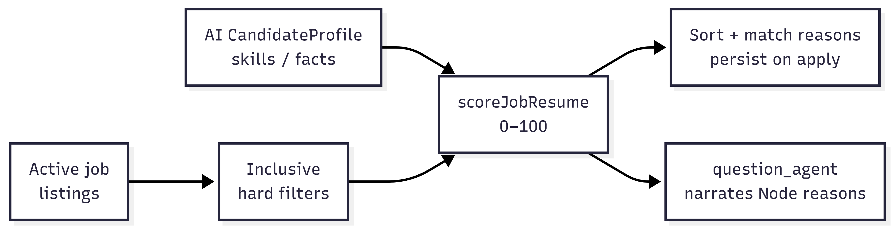

*Figure C-5. Skill-first job matching flow.*

### Why these choices

| Decision | Rationale | Deferred alternative |
|----------|-----------|----------------------|
| LangGraph + **deterministic planner clamps** | Predictable agent chains under production latency; keyword/forced-intent overrides reduce freestyle mis-routing | Unconstrained multi-agent chat only |
| Resume SSE & interactive interview **outside** the graph | Progress events and multi-turn polling do not fit a single chat completion; still share `CopilotState` | Forcing everything through `/api/chat` |
| One model ID, **task-specialised configs** (`llm` / `resume_generation` / `judge`) | Same SiliconFlow checkpoint (`DeepSeek-R1-0528-Qwen3-8B`); lower temperature for judge rubrics | Separate model fleets per task |
| **Node** skill-first match scoring | Auditable additive scores; agents narrate Node reasons instead of inventing a second ranker | LLM-as-ranker / vector similarity as primary score |
| Donation → access booleans | Social-enterprise funding for legal-aid pool without swapping model weights | Paywalled model tiers |
| OCR / RAG / resource recommender **off by default** | Typical uploads are editable PDF/DOCX (pdfplumber suffices); cost–latency at pilot scale | Always-on OCR + Chroma RAG |

## Quick Start

### Prerequisites

- Docker and Docker Compose
- API keys (at least `SILICONFLOW_API_KEY`)
- Reachable MySQL (AI DB `ai_career_copilot`) and Redis for session state — see [backend/DEPLOYMENT.md](backend/DEPLOYMENT.md) for the dual-DB layout (`gba_website` for Node auth)

### Run with Docker

```bash
cp .env.docker.example .env.docker
# Fill SILICONFLOW_API_KEY, MYSQL_*, REDIS_*, and optional keys

docker compose up -d
```

Default host ports (overridable in `.env.docker`):

| Service | Port |
|---------|------|
| Frontend (nginx) | `3001` |
| FastAPI AI backend | `8000` |

Open the individual portal via the frontend container (port `3001`). For Node auth API, local/production layout, and 2GB-host constraints, follow [backend/DEPLOYMENT.md](backend/DEPLOYMENT.md) and [backend/TESTING_GUIDE.md](backend/TESTING_GUIDE.md).

## Usage

### Individual portal — AI entry

From the individual portal, open the three AI tools that share one profile/JD session.

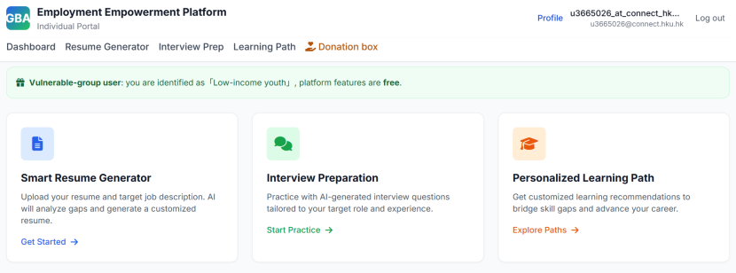

*Figure D-1. Individual Portal AI Feature Entry.*

### Smart resume

1. Upload material (or paste text); the system extracts a structured profile.
2. Confirm or generate a target JD; answer gap clarification questions.
3. Watch SSE progress while modules are generated and polished.
4. Export PDF, DOCX, or HTML.

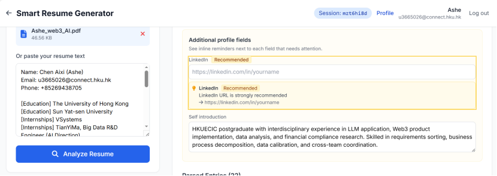

*Figure D-2. Smart Resume — Material Upload and Profile Extraction.*

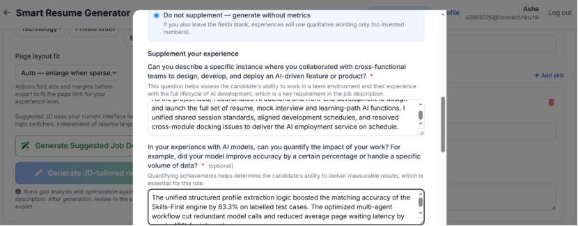

*Figure D-3. Smart Resume — Target JD and Gap Clarification.*

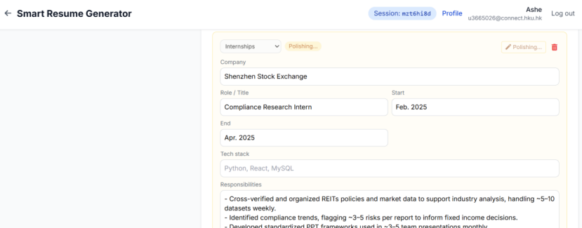

*Figure D-4. Smart Resume — SSE Generation and Module Polish.*

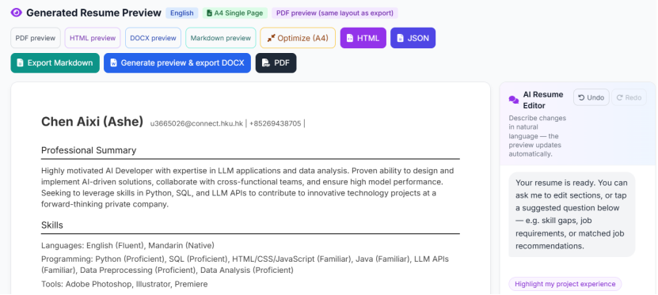

*Figure D-5. Smart Resume — Export Options.*

### AI mock interview

Select Quick / Full / Specialized (or bank / custom modes), practise turns with feedback, then review the session debrief.

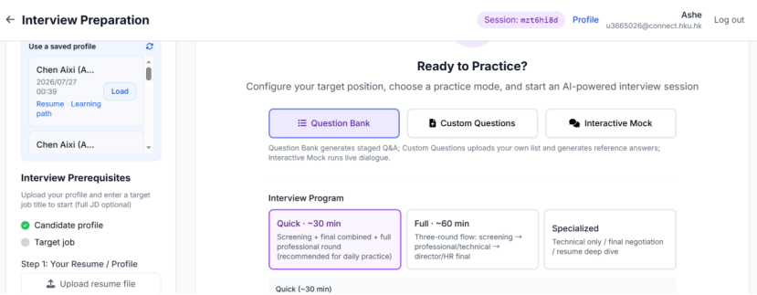

*Figure D-6. AI Mock Interview — Programme Mode Selection.*

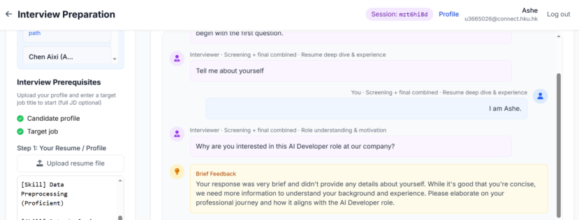

*Figure D-7. AI Mock Interview — Interactive Turn with Feedback.*

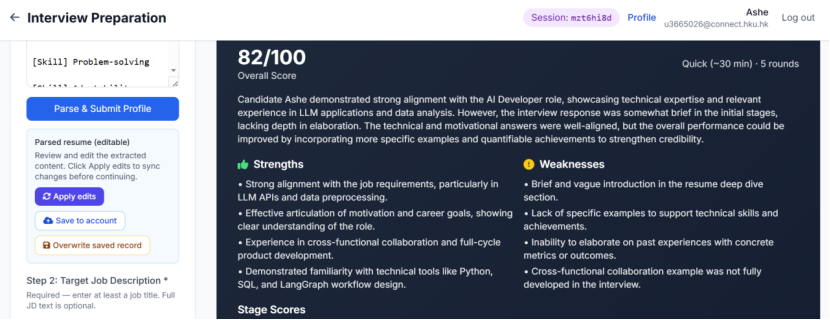

*Figure D-8. AI Mock Interview — Session Debrief.*

### Skill learning path

Reuse the same gaps for diagnosis, then edit a study timeline shaped by daily available hours.

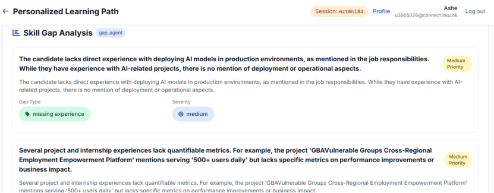

*Figure D-9. Skill Learning Path — Gap Diagnosis.*

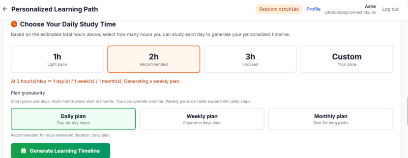

*Figure D-10. Skill Learning Path — Editable Study Timeline.*

### Skill-first job matching

Listings show inspectable match scores driven by Node rules (skill overlap dominates), using AI-structured profile features as upstream input.

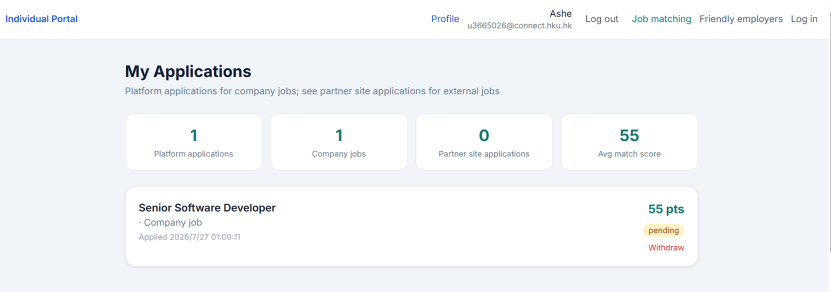

*Figure D-11. Skill-First Job Matching Scores.*

Demo walkthrough videos (optional): [docs/demo-videos/](docs/demo-videos/).

## Evaluation Results and Limitations

Pilot and offline metrics (Chapter 6, Table 6-3) are archived under [`evaluation-results/chapter6-pilot/`](evaluation-results/chapter6-pilot/).

| Evaluation | Sample | Result |
|------------|--------|--------|
| Language-consistency guard (clean vs mixed multilingual uploads) | 8 | 100% discrimination |
| Structured profile/job field coverage | 6 checks | 100% |
| Interview feedback actionability | 6 items | 100% actionable |
| Job–resume match bands & ranking | 6 labelled pairs | 83.3% band / **100%** ranking |
| Planner intent & agent chain (`rule_only`) | 20 | **100%** accuracy, macro-F1 1.00 |
| Cross-agent chain consistency | 5 | **40%** (2/5)—failure modes documented |
| Pytest core AI subset | — | 55 passed |

Reproduce match-band and language-consistency pilots:

```bash
node evaluation-results/chapter6-pilot/run_match_pilot.js
python evaluation-results/chapter6-pilot/run_pilot_metrics.py
```

**Limitations (honest):** results are dissertation-scale pilots, not million-row A/B logs. Planner 100% applies to **rule_only** mode (deterministic clamps), not unconstrained LLM routing. Chain-consistency deliberately includes adversarial fail cases (empty render HTML, corrupted profile fields) retained as a hardening backlog. OCR, RAG, curated learning resources, and end-to-end blind screening are **not** Class A. Remote LLM latency is on the order of minutes for large interview banks—hence SSE progress, polling, and queue limits.

## Project Structure

```
├── individual/          # Individual job-seeker portal (resume, interview, learning path)
├── corporate/           # Employer portal (jobs, Premium HR kits / analytics gating)
├── server/              # Node.js auth, donations, access flags, jobs, match scoring
├── backend/             # Python FastAPI + LangGraph agents (CopilotState in Redis)
├── docker/              # Dockerfiles and nginx config
├── docs/                # Technical docs, images (Figure C/D), demo videos
├── evaluation-results/  # Offline / pilot evaluation artefacts
├── test-data/           # Fixtures and golden data
├── LICENSE              # MIT
└── README.md
```

## Documentation

| Document | Description |
|----------|-------------|
| [Chapter 6 — AI Algorithm & Agent Technical Realization](docs/Chapter6_AI_Algorithm_Agent_Technical_Realization_EN.md) | Authoritative AI architecture, Class A/B/C boundary, evaluation |
| [Requirements and technical solution](GBA_Cross-Border_Employment_Empowerment_Platform_Requirements_and_Technical_Solution_Document.md) | Product scope |
| [Python deployment guide](backend/DEPLOYMENT.md) | RDS / Redis / production hosts |
| [Backend testing guide](backend/TESTING_GUIDE.md) | API and integration tests |
| [Testing summary](TESTING_SUMMARY.md) | Project-wide test index |
| [Evaluation results index](evaluation-results/README.md) | Planner, RAG, chain consistency, human review |
| [Chapter 6 pilot artefacts](evaluation-results/chapter6-pilot/) | Match / language pilot scripts and reports |

## License

This project is released under the [MIT License](LICENSE). Copyright (c) 2026 GBA-VEEP.
