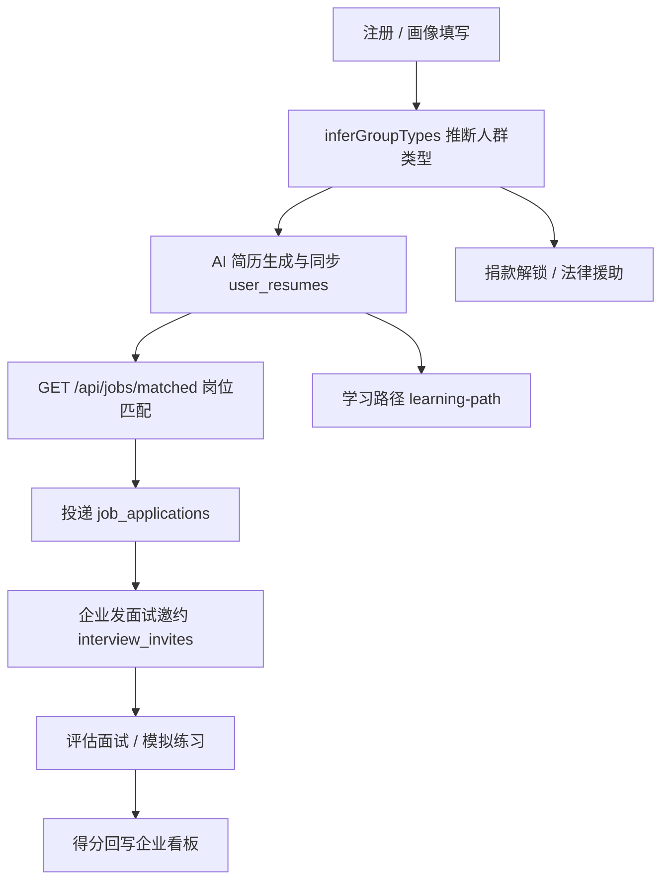
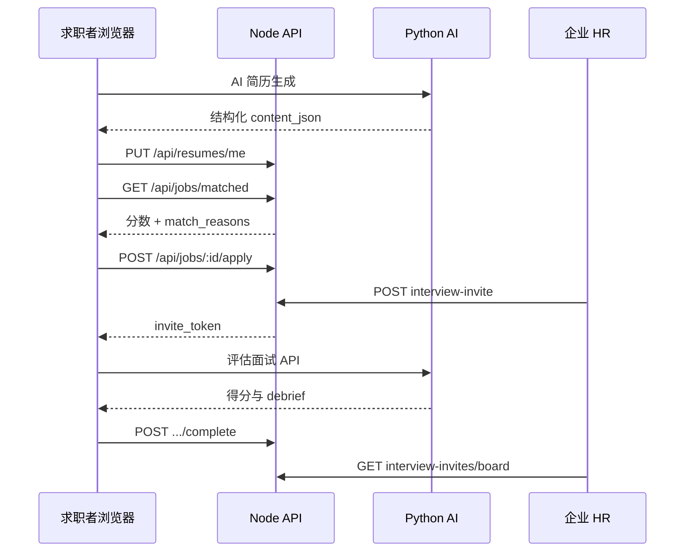

# 5. System Design & Technical Implementation  
# 系统设计与技术实现

> **项目名称**：GBA Vulnerable Groups Cross-Regional Employment Empowerment Platform（GBA-VEEP）  
> **撰写人**：洪扬萱  
> **对应章节**：终期 Project Report 第 5 章（约 8,000 字）  
> **编写依据**：Detailed Proposal（2026 年 1 月）、Interim Report（2026 年 5 月 14 日）、本仓库 `individual/`、`corporate/`、`server/`、`backend/`、`crawler/`、`docker/` 实际代码与部署配置  
> **说明**：AI 简历 Agent 的算法编排、提示词设计与评测指标见第 6 章（陈艾茜），本章仅交代系统集成方式。

---

## 5.1 引言

粤港澳大湾区（GBA）“9+2”城市群的跨境人力资源流动，是区域协同发展的关键动能。然而，残障人士、45 岁以上银发劳动者、低收入青年、职业空窗返岗女性等弱势群体，在跨区域求职中仍普遍遭遇信息分散、标签歧视与技能表达不足等障碍。Detailed Proposal 将 GBA-VEEP 定位为以 **Agentic AI** 与 **Compliance-as-a-Service** 为支撑的一站式就业赋能平台；中期 Interim Report（2026 年 5 月）则确认：平台核心架构、基础 AI 赋能框架与包容性无障碍交互体系已初步建成，并进入功能完善与试点运营阶段。

作为小组中负责平台开发的同学，本章从**工程实现**角度说明终期系统的技术方案与落地情况，重点回答三个问题：

1. 网站全部功能模块如何组织与协同运行；  
2. 技术架构、数据库与 API 如何支撑 Proposal 提出的“技能优先、盲筛匹配、一站式闭环”理念；  
3. 哪些能力已在代码中实现、哪些仍属中长期规划。

写作原则如下：**以仓库可运行代码为准**，Proposal 中的 GBA Data Vault 全自动化、区块链微证书、语音助手全链路等愿景能力，若尚未在代码中落地，则在 5.14 节如实对照，不作夸大陈述。AI 简历生成、模拟面试与学习路径的内部算法细节不在本章展开，以免与第 6 章重复。

---

## 5.2 设计目标与业务闭环

### 5.2.1 设计目标

结合 Proposal 与中期报告，终期系统工程实现围绕以下目标展开：

| 编号 | 设计目标 | 代码落点 |
|:----:|----------|----------|
| G1 | 技能优先、能力本位匹配 | Node 侧 `match.service.js` 四维评分 + 硬性条件筛选 |
| G2 | 降低标签歧视、扩大友好岗位供给 | `group_types` 推断、友好岗排序、残联外部岗位爬虫 |
| G3 | 一站式就业闭环 | 注册画像 → 简历 → 匹配投递 → 面试 → 学习 → 法律援助 |
| G4 | 双端差异化服务 | `individual/` 求职者门户与 `corporate/` 企业门户 |
| G5 | 可部署、可演示 | Docker Compose + Nginx 分流 + 健康检查 |

### 5.2.2 设计原则

**（1）业务态与 AI 态分离。** 用户账号、岗位、投递、捐款、法律援助等“业务事实”存入 Node 管理的 `gba_website` 库；AI 会话、简历草稿、面试问答等“智能过程态”存入 Python 管理的 `ai_career_copilot` 库。简历匹配所需结构化快照通过 `PUT /api/resumes/me` 从 AI 侧同步至业务库，使匹配引擎不直接依赖 AI 库，降低耦合。

**（2）统一身份、分服务校验。** Node 签发 JWT，Python 后端复用同一 `JWT_SECRET` 验签（`backend/auth/jwt.py`），避免双端登录体系不一致。

**（3）弱势群体优先可达。** 注册时根据年龄、残障类型、职业空窗、收入等字段，由 `inferGroupTypes()` 自动推断 `group_types`（见 `server/src/constants/groupTypes.js`）。弱势群体个人用户**免捐**解锁核心与高级功能；企业用户基础招聘免费，面试套件等高级能力需捐款解锁（`access.service.js`）。

**（4）前端轻量、便于无障碍适配。** 采用多页静态站点（HTML/CSS/原生 JavaScript），未引入 React/Vue 构建链，有利于逐页优化键盘导航与屏幕阅读器兼容性，呼应中期报告 WCAG 2.2 取向。

**（5）外部岗位合规聚合。** 爬虫仅抓取广东省残疾人就业服务网（jyfw.org.cn）**公开 API**，保留 `source_url` 与 `external_id`，不伪造投递闭环。

### 5.2.3 与 Proposal 闭环的映射

Proposal 提出“注册—技能评估—简历优化—岗位匹配—技能培训—入职—跟踪”闭环。终期代码中的实现路径如下：



该闭环在个人端 `portal.html` 的功能卡片与企业端 Dashboard、My Jobs、Interview Board 中均可端到端演示，是终期结项的核心交付物。

### 5.2.4 从中期报告到终期的演进

中期 Interim Report 将建设成果归纳为三大模块，终期工程与之对应关系如下：

| 中期模块 | 终期工程对应 | 代表性交付 |
|----------|--------------|------------|
| Platform Core Architecture and Infrastructure | 三栈、双库、Docker/Nginx、JWT、13 次 DB 迁移 | `init.sql`、`docker-compose.yml`、`nginx.conf` |
| Basic AI Empowerment Framework | FastAPI 接口族、简历/面试/学习路径集成、结果回流 | `backend/main.py`、双库简历同步 |
| Inclusive Accessibility Interaction System | 轻量 MPA、企业 audit 页、弱势群体推断与免捐策略 | `groupTypes.js`、`access.service.js`、`audit.html` |

终期工作并非另起炉灶，而是在中期“地基”之上补齐匹配、投递、邀约、捐款法律援助等业务闭环，使平台从“可演示原型”升级为“功能完整的就业赋能网站”。

### 5.2.5 与 Detailed Proposal 四大业务模块的对照

Detailed Proposal 第 V 章提出四大核心业务模块。终期工程与代码仓库的对应关系如下：

| Proposal 模块 | 终期工程落点 | 实现状态 |
|---------------|--------------|:--------:|
| Skills-First AI Matching Engine | `match.service.js` 硬性筛选 + 四维评分；AI 简历同步 `user_resumes`；企业端弱势群体优先排序 | ✅ |
| GBA Policy Dividend Navigator | `demo-policy-navigator.html` 政策红利导航演示 | ◐ |
| Compliant GBA Data Vault | 双库隔离、JWT 最小权限、附件限量、`.env` 密钥外置、业务轨迹落库 | ◐ |
| Remote & Inclusive Flex-Hub | 弱势群体推断与免捐、友好岗聚合、`audit.html`/`certification.html`、WCAG 取向前端 | ✅ |

该对照表明：平台已将 Proposal“能力本位匹配 + 包容性可达 + 合规服务化”主线转化为可运行代码；政策导航自动化、数据金库全自动化等增强能力以演示页或架构预留形式呈现，完成度见 5.14 节。

---

## 5.3 总体技术架构

### 5.3.1 三栈架构

平台采用 **静态多页前端 + Node.js 业务 API + Python AI 服务** 的三栈架构。生产环境由 Nginx 按路径前缀分流；数据层使用 MySQL（双库）与 Redis；向量检索使用本地 ChromaDB。

```
                         ┌─────────────────────────────┐
                         │   Browser（个人端 / 企业端）   │
                         │  individual/  corporate/     │
                         └──────────────┬──────────────┘
                                        │
                              Nginx 路径分流（docker/frontend/nginx.conf）
                    ┌───────────────────┼───────────────────┐
                    ▼                   ▼                   ▼   
             静态 HTML/CSS/JS    Node Express :3000   Python FastAPI :8000
             assets/ 共享组件      JWT / 岗位 / 匹配      简历 / 面试 / 学习路径
                    │                   │                   │
                    └───────────────────┴─────────┬─────────┘
                                                  ▼
                              MySQL: gba_website + ai_career_copilot
                              Redis（会话 / LLM 队列）+ ChromaDB（RAG）
```

**图 5-1　GBA-VEEP 三栈总体架构**

| 组件 | 目录 | 端口 | 职责 |
|------|------|:----:|------|
| 静态前端 | `individual/`、`corporate/`、`assets/` | 8080（本地）/ 80（Docker） | 双端 UI、i18n、访问控制前端钩子 |
| Node 业务 API | `server/` | 3000 | 认证、岗位、匹配、投递、捐款、法律援助、面试邀约、统计 |
| Python AI 后端 | `backend/` | 8000 | 简历流水线、模拟/评估面试、学习路径、Chat、MCP |
| 岗位爬虫 | `crawler/` | 定时任务 | 同步残联公开岗位至 `job_postings` |

### 5.3.2 请求分流（Nginx 网关）

Docker 前端容器中的 Nginx 承担轻量 API 网关职责，配置见 `docker/frontend/nginx.conf`：

| 路径前缀 | 转发目标 | 说明 |
|----------|----------|------|
| `/api/auth`、`/api/jobs`、`/api/company`、`/api/resumes`、`/api/donations`、`/api/legal-aid`、`/api/stats`、`/api/interview-invites` | Node `:3000` | 业务与认证 |
| 其余 `/api/*` | Python `:8000` | AI 能力（简历、面试、学习路径等） |
| `/mcp/*` | Python `:8000` | MCP SSE 长连接（关闭缓冲） |
| `/health` | Python `:8000` | 健康检查 |
| `/individual/*`、`/corporate/*` | 静态文件 | 回退至各端 `portal.html` |

本地开发时，前端通过 `assets/js/node-api-base.js` 将业务请求直连 `localhost:3000`，AI 请求指向 `localhost:8000`，便于分服务调试。

### 5.3.3 双库边界

| 数据库 | 归属 | 存储内容 |
|--------|------|----------|
| `gba_website` | Node | 用户、组织、岗位、投递、捐款、法律援助、面试邀约等业务事实 |
| `ai_career_copilot` | Python | 会话、JD 缓存、简历内容、面试问答、学习路径计划等 AI 过程态 |

这一划分使“智能产过程、业务沉淀事实”成为全项目的基本工程约定：AI 负责生成与测评，Node 负责权限、持久化与可审计的业务状态。

---

## 5.4 技术选型

| 层级 | 选用技术 | 选型理由 |
|------|----------|----------|
| 前端 | HTML5 / CSS3 / 原生 JS；Tailwind CDN；Axios；Chart.js | 多页静态、依赖少、利于无障碍与快速迭代；答辩演示可直接打开页面 |
| 业务后端 | Node.js ≥18、Express 4、mysql2、JWT、bcryptjs、helmet | 适合 JWT 认证与 CRUD 业务；与前端 JSON 交互自然 |
| AI 后端 | Python、FastAPI、LangGraph、Pydantic、ChromaDB | Agent 编排与结构化输出在 Python 生态更成熟（详见第 6 章） |
| 文档处理 | pdfplumber、PyMuPDF、python-docx、WeasyPrint | 支撑简历解析与 PDF/DOCX 导出 |
| 数据 | MySQL 8 / MariaDB 10、Redis | 业务持久化 + 会话与 LLM 并发控制 |
| 爬虫 | requests、PyMySQL、APScheduler | 定时拉取残联公开岗位 |
| 部署 | Docker Compose、Nginx | 前后端容器化；Node 可宿主机常驻对接云 RDS |

**为何采用三栈而非单体？** 第一，招聘业务规则（匹配权重、捐款解锁、组织权限）与 LLM Agent 生命周期差异大，分栈可独立扩缩容与排错；第二，小组内平台开发与 AI 算法可并行推进；第三，AI 推理超时或队列拥堵时，岗位浏览、投递、捐款等业务接口仍可独立可用。

### 5.4.1 Node 业务层模块划分

`server/src/` 按经典 MVC 分层组织，便于答辩时按模块讲解：

| 目录 | 职责 | 示例 |
|------|------|------|
| `routes/` | 路由注册与 HTTP 入口 | `jobs.routes.js`、`interviewInvites.routes.js` |
| `controllers/` | 请求校验、编排、响应 | `jobs.controller.js`、`applications.controller.js` |
| `services/` | 纯业务逻辑 | `match.service.js`、`access.service.js` |
| `models/` | SQL 与数据访问 | `job.model.js`、`user.model.js` |
| `middleware/` | 认证、限流 | `auth.middleware.js` |
| `constants/` | 枚举与规则 | `groupTypes.js` |

岗位匹配的典型调用链为：路由 → `jobs.controller` → `job.model.listMatchedForUser()` → 逐条调用 `userMatchesJobCriteria()` 与 `scoreJobResume()` → 写入曝光表 → 返回带分数列表。该链路全部在 Node 进程内同步完成，课程项目规模下响应时间可接受；若未来用户量上升，可将评分改为异步任务，或引入向量召回 + 规则精排的两阶段架构，而无需推翻现有三栈。

### 5.4.2 前端共享组件

双端页面不各自维护一套登录/捐款逻辑，而是将共用能力沉淀在 `assets/`：

| 组件/脚本 | 路径 | 作用 |
|-----------|------|------|
| 认证 API | `assets/js/auth-api.js` | 注册登录、Token 读写、401 跳转 |
| Node 基址 | `assets/js/node-api-base.js` | 本地/Docker 环境 API 地址解析 |
| 访问控制 | `assets/js/platform-access.js` | 查询捐款解锁状态、控制按钮可见性 |
| 捐款箱 | `assets/js/donation-box.js` | 个人端与企业端复用 |
| 法律援助 | `assets/js/legal-aid.js` | 诉求提交、接单、平台协助 |
| i18n | `assets/i18n/i18n.js` + 四语词条 | 界面文案切换 |

小组约定：页面改动进 `individual/` 或 `corporate/`，业务规则进 `server/`，Agent 进 `backend/`，岗位补给进 `crawler/`，部署进 `docker/`。该约定降低合并冲突，也使本章架构描述与仓库目录一一对应。

---

## 5.5 部署与运行环境

### 5.5.1 本地开发

典型启动组合：

1. 静态页托管（`static-server.js`，默认 **8080**）；  
2. `server/` 启动 Express（**3000**）；  
3. `backend/` 启动 Uvicorn（**8000**）；  
4. 连接 MySQL 与 Redis；  
5. 可选运行 `crawler/scheduler.py` 定时同步外部岗位。

### 5.5.2 Docker Compose

`docker-compose.yml` 编排两个容器：

- `ai-career-copilot-backend`：Python 镜像，入口执行建表后启动 Uvicorn；  
- `ai-career-copilot-frontend`：Nginx 托管静态资源并分流 API。

MySQL（阿里云 RDS）、Redis、Node API 通过环境变量与 `host.docker.internal` 接入，数据库不强行打包进 Compose，便于本地开发与云上演示切换。

### 5.5.3 配置管理

敏感配置通过 `.env` / `.env.docker` 注入，包括 `MYSQL_*`、`JWT_SECRET`（Node 与 Python 必须一致）、`SILICONFLOW_API_KEY`、`DASHSCOPE_API_KEY`、`REDIS_HOST` 等。仓库提供 `.env.docker.example` 作为模板，密钥不入库。

**表 5-7　典型环境变量**

| 变量 | 用途 | 备注 |
|------|------|------|
| `JWT_SECRET` | Node 签发 / Python 验签 | 两端必须相同 |
| `MYSQL_HOST` / `MYSQL_PASSWORD` | 双库连接 | 生产使用阿里云 RDS |
| `REDIS_HOST` | 会话与 LLM 队列 | Docker 内常用 `host.docker.internal` |
| `SILICONFLOW_API_KEY` | LLM 调用 | DeepSeek-R1 |
| `DASHSCOPE_API_KEY` | Embedding / Rerank | 可切换本地 PyTorch |

---

## 5.6 数据库设计

### 5.6.1 业务库核心表

依据 `server/sql/init.sql` 及 v2–v12 系列迁移脚本，业务库核心实体如下。

**表 5-1　`gba_website` 核心表结构**

| 表名 | 用途 | 设计要点 |
|------|------|----------|
| `users` | 账号与画像 | `role`∈{individual, corporate, admin}；画像含 age/gender/disability_type/career_gap_years/current_income；`group_types` JSON 由系统推断 |
| `company_orgs` / `company_org_members` | 多 HR 组织 | `invite_code` 邀请加入；成员角色 owner/recruiter/viewer |
| `company_profiles` | 企业资料 | 包容性用工说明、`vulnerable_group_friendly` 标签 |
| `job_postings` | 内部岗 + 外部爬虫岗 | `source` internal/external；`target_criteria`；`interview_format`；`skills` JSON |
| `user_resumes` | 匹配用简历快照 | `content_json`、`skills_text`；AI 侧同步写入 |
| `job_applications` | 投递记录 | `match_score`、`match_reasons`、`resume_snapshot`；状态 pending→reviewing→accepted/rejected |
| `job_match_impressions` | 匹配曝光去重 | (job_id, user_id) 主键，支撑 `matches_count` 统计 |
| `job_external_interests` | 外部岗跳转意向 | 记录用户对外链友好岗的点击意向 |
| `donations` | 捐款箱 | `purpose=legal_service`，全额用于弱势群体法律服务 |
| `legal_aid_requests` / `legal_aid_responses` | 法律援助 | 申请—接单—平台协助；附件 JSON（最多 3 个、单文件 ≤200KB） |
| `interview_invites` | 企业面试邀约 | `invite_token`；看板按 `invited_by_user_id` 隔离；得分回写字段 |

数据库自 v2 匹配功能起，经 v3 人群推断、v4 岗位条件、v5 捐款与外部友好岗、v6–v9 法律援助、v10–v12 面试邀约与面试方式等 13 次迁移迭代，体现终期功能是在中期架构之上**逐步叠加**而非重写。

### 5.6.2 弱势群体类型推断

系统不依赖用户自我勾选标签作为唯一依据，而在注册/更新画像时调用 `inferGroupTypes()` 自动推断（可多项并存）：

| 类型键 | 含义 | 推断规则 |
|--------|------|----------|
| `disability` | 残障人士 | `disability_type` 存在且不为 `none` |
| `elderly_45plus` | 45+ 劳动者 | 年龄 ≥ 45 |
| `career_returner` | 职业返岗女性 | 性别为女且职业空窗 ≥ 1 年 |
| `youth` | 低收入青年 | 年龄 ≤ 30 且月收入 ≤ 8,000 元 |

该规则直接驱动三项产品策略：**免捐访问**、**友好岗筛选**、**企业端应聘者弱势群体优先排序**（`sortApplicantsForCorporate`）。

### 5.6.3 岗位目标条件（target_criteria）

企业发岗时可配置年龄区间、性别、残障开放策略、职业空窗策略及“是否优先弱势群体”。系统据此推导 `target_group_types` 与 `vulnerable_group_friendly` 标签。与传统招聘网站“默认隐藏残障信息、却用学历年龄隐性排除”不同，本平台把包容条件**显式化、可计算化**，是 Proposal 中 Blind Screening 与 Inclusive Flex-Hub 精神在业务层的具体体现。

个人端匹配时，`userMatchesJobCriteria()` 先执行硬性筛选；对外部友好岗（`source=external` 且 `vulnerable_group_friendly=1`）则放宽条件，避免因画像字段不全挡住真实机会。

### 5.6.4 AI 库 `ai_career_copilot`（概要）

AI 库由 Python 后端在启动时通过 `backend/sql/init_db.py` 初始化，主要保存与会话生命周期绑定的对象，包括：`sessions`（用户会话）、`jobs`（JD 结构化 JSON）、`candidate_profiles`（画像抽取结果）、`resume_contents`（简历正文与版本）、`render_configs`（排版配置）、`interview_qas`（面试问答记录）、`interactive_interview_sessions`（交互式模拟面试）、`learning_path_plans`（学习路径计划）、`jd_cache`（岗位描述缓存）等。

业务侧**不直接查询** AI 库，而是通过两条同步通道消费 AI 产出：（1）简历结构化内容 → `user_resumes.content_json`；（2）评估面试得分 → `interview_invites.overall_score` 等字段。这种“过程在 AI 库、结果在业务库”的模式，既方便 Agent 频繁迭代提示词与编排逻辑，又保证匹配、投递、看板等核心业务只依赖稳定的 Node 数据模型。

---

## 5.7 身份认证、角色与访问控制

### 5.7.1 JWT 认证流程

1. 用户在 `individual/auth.html` 或 `corporate/auth.html` 注册/登录；  
2. Node `POST /api/auth/register|login` 校验后签发 JWT（载荷含 `sub/username/role`）；  
3. 前端 `assets/js/auth-api.js` 将令牌存入 `localStorage`；  
4. 后续请求携带 `Authorization: Bearer <token>`；  
5. Node 中间件 `authenticate` / `requireRole` 校验；Python 侧用同一密钥验签。

企业注册支持两种路径：**新建组织**（自动生成 `invite_code`），或通过邀请码加入已有组织，实现多 HR 协作。数据库已预留 `password_reset_tokens` 表（迁移 `migrate_v8_password_reset.sql`）；当前终期主路径为注册/登录与 `POST /api/auth/change-password` 改密。

### 5.7.2 捐款解锁策略

`getPlatformAccess()` 实现平台级差异化权限：

| 用户类型 | 基础访问 `has_access` | 高级访问 `has_premium_access` |
|----------|:---------------------:|:-----------------------------:|
| admin | ✓ | ✓ |
| 弱势群体个人（`group_types` 非空） | ✓（免捐） | ✓ |
| 非弱势群体个人 | 需至少捐款一次 | 同左 |
| 企业用户 | ✓（基础招聘） | 需捐款（面试套件、团队绩效等） |

前端通过 `assets/js/platform-access.js` 与 `data-require-access` / `data-require-premium-access` 属性控制入口可见性；后端对所有写操作仍强制校验，形成“前端引导 + 后端兜底”的双层控制。该机制将 Proposal 中的“公益捐赠—法律服务资金池—功能解锁”叙事落到了可运行的代码逻辑中。

### 5.7.3 资源级权限

- 企业内部岗位：创建/更新/关闭需校验所有者或组织成员；  
- 面试看板：按 `invited_by_user_id` 隔离，同组织不同 HR 无法越权查看他人邀约；  
- 法律援助：申请人、接单人、平台协助角色分流；  
- 安全加固：`helmet`、登录限流、密码 bcrypt、express-validator 输入校验。

---

## 5.8 前端功能实现

前端采用**多页应用（MPA）**：个人端 21 个 HTML 页面、企业端 8 个 HTML 页面，共享 `assets/` 下的认证、i18n、捐款与法律援助组件。首页 `index.html` 提供角色分流；各端 `portal.html` 为功能导航中枢。

### 5.8.1 个人求职者端

**表 5-2　个人端页面与功能对照**

| 功能模块 | 页面文件 | 主要能力 |
|----------|----------|----------|
| 认证与画像 | `auth.html`、`profile.html`、`credentials.html` | 注册登录；完整画像；`group_types` 自动更新 |
| 门户导航 | `portal.html` | 功能卡片、访问横幅、AI Session 管理 |
| 岗位浏览与匹配 | `demo-jobs-database.html`、`friendly-employers.html`、`apply.html` | 调用 `GET /api/jobs/matched`；展示分数与 match_reasons |
| 我的投递 | `my-applications.html` | 申请/撤回/状态跟踪；查看企业面试邀约 |
| AI 简历 | `demo-resume-generator.html`、`my-resume.html`、`demo-resume-matching.html` | 上传—缺口分析—生成—预览导出；匹配演示；同步 Node 简历 |
| 模拟面试 | `demo-interview.html` | 练习型题库/交互式模拟（Python `/api/interview/*`） |
| Olivia 对话助手 | `demo-olivia.html` | Proposal 包容性语音/对话助手愿景演示，与门户 Chat 互补 |
| 企业评估面试 | `assessment-interview.html` | 凭邀约 token 进入；正式测评无实时辅导；结果回写 |
| 学习路径 | `demo-learning-path.html`、`course-learning.html` | 能力缺口时间线与课程学习 |
| 捐款与法律援助 | `donation-legal.html` | 捐款解锁；提交诉求/接单/平台协助 |
| 政策与社区 | `demo-policy-navigator.html`、`community.html` | 政策导航与社区展示（演示向页面） |

### 5.8.2 企业端

**表 5-3　企业端页面与功能对照**

| 功能模块 | 页面 / 入口 | 主要能力 |
|----------|-------------|----------|
| 认证与组织 | `auth.html` | 建组织 / 邀请码加入 |
| Dashboard | `portal.html` + `dashboard-stats.js` | Chart.js 可视化：招聘漏斗、多元性指标 |
| 公司资料 | `company-profile.html` | 包容性用工信息维护 |
| My Jobs | `portal.html#jobs`、`post-job.html` | 岗位 CRUD、状态管理、克隆、目标条件、面试方式配置 |
| 应聘者管理 | 岗位详情弹窗 | 弱势群体优先排序；状态流转；发面试邀请 |
| 面试看板 | `portal.html#interview-board` | 按邀请人隔离的邀约进度与得分 |
| 无障碍审计 / 包容认证 | `audit.html`、`certification.html` | 雇主侧合规自检与认证导向工具 |
| 捐款法律援助 | `donation-legal.html` | 与个人端共用组件逻辑 |
| HR 高级工具 | Candidate Screening / Interview Kits / Talent Matching 模态 | 与 `has_premium_access` 绑定 |

### 5.8.3 国际化

共享 i18n 框架位于 `assets/i18n/`，词条覆盖 **en / zh-CN / zh-TW / pt** 四种语言。产品演示界面当前以英文为主（便于国际评审），简历与 AI 输出仍支持多语种切换，对应 Proposal 对大湾区语言多样性的覆盖方向。

### 5.8.4 前端状态、会话与可演示性设计

**认证态管理。** 各页面在加载时通过 `auth-api.js` 读取 `localStorage` 中的 JWT，未登录用户访问需认证页面时跳转 `auth.html`；401 响应统一触发登出与重定向，避免“半登录”状态。

**AI Session 管理。** 个人端 `portal.html` 支持创建、切换与延续 AI 会话上下文，使用户在简历生成、模拟面试、学习路径之间无需反复上传同一份材料。Session ID 由 Python 后端分配并绑定用户身份，防止跨用户串话。

**访问控制渲染。** 页面渲染前查询 `/api/donations/access`（或等价 access 接口）：弱势群体用户静默放行全部入口；非弱势群体未完成捐款时，带 `data-require-access` 属性的按钮显示引导横幅；企业用户未捐款时，Interview Kits、Team Performance 等 premium 模块同样被拦截。后端对所有写操作仍强制校验，前端控制仅负责体验引导。

**空状态与错误处理。** 结项答辩要求系统在缺数据时仍可读：匹配页无简历时给出补全提示并降低分数上限；无岗位时展示空状态卡片；面试 token 失效时返回明确文案；捐款未完成时引导至 `donation-legal.html` 而非静默失败。Node 与 Python 分别提供健康检查端点（Node 根路由、Python `/health`），便于部署验收。

**信息架构一致性。** 双端门户遵循“一次只做一件事”：首页负责角色分流，`portal.html` 负责模块导航，具体业务页承载单一任务（发岗、投递、面试、捐款等）。企业端 `portal.html` 以锚点模块（`#dashboard`、`#jobs`、`#interview-board`）组织 HR 日常工作流，减少页面跳转，适合现场演示。

---

## 5.9 核心业务模块

### 5.9.1 岗位管理与外部岗位聚合

**内部岗位**：企业通过 `post-job.html` 发布，写入 `job_postings`（`source=internal`）。除标题、地点、薪资、技能等基础字段外，还可配置：

- `target_criteria`：年龄、性别、残障、空窗等硬性条件；  
- `interview_format`：`ai_only` / `partial_custom` / `full_custom` / `human`；  
- `interview_custom_questions`：企业自拟面试题；  
- `meeting_link`：人工面试会议链接。

**外部岗位**：`crawler/scraper.py` 对接 jyfw.org.cn 三个公开接口——热门岗位、招聘单位列表、按单位拉取岗位——经 `upsert_external_job` 写入同表（`source=external`），并维护 `is_active_on_source`。调度器默认约 30 分钟一轮，采用线程池并发抓取单位岗位，失败自动重试。爬虫工程约束如下：

- 仅访问**无需登录**的公开 REST API，请求头携带合规 User-Agent；  
- 每条外部岗保留 `external_id`、`source_url` 与 `raw_data` 原始 JSON，便于溯源；  
- 源站下架岗位时，通过 `mark_missing_external_jobs` 标记 `is_active_on_source=0`，不在平台展示过期信息；  
- 用户点击外链时在 `job_external_interests` 记录意向，**不在平台内代理报名**，避免越权与数据责任不清。

这一设计在扩大弱势群体可见岗位池的同时，符合学术项目对数据来源克制、可追溯的要求。

### 5.9.2 技能优先匹配引擎

Proposal 中的 Skills-First Matching Engine 在业务层落地为 Node 侧可解释的确定性评分服务 `match.service.js`（非黑盒向量匹配，便于答辩说明与审计）。

**第一步：硬性筛选。** `userMatchesJobCriteria()` 校验用户画像是否满足岗位 `target_criteria`。

**第二步：软性评分（0–100 分）。** `scoreJobResume()` 按以下权重计算：

| 维度 | 上限分 | 计算逻辑 |
|------|:------:|----------|
| 技能重叠 | 50 | 岗位 skills JSON + 描述关键词，与简历 skills_text / facts 模糊包含匹配 |
| 学历 | 15 | 博士→高中层级对照 |
| 经验 | 20 | 实习/项目/工作事实条数与岗位经验描述对照 |
| 描述关键词 | 15 | 职位描述关键词命中简历全文 |

同时返回 `match_reasons` 数组，前端直接展示“为何推荐此岗”，体现可解释匹配。

**第三步：曝光与排序。** 个人端按分数降序展示；首次展示写入 `job_match_impressions` 去重累计 `matches_count`。企业端在友好岗场景下，`sortApplicantsForCorporate()` **先按是否弱势群体、再按匹配分**排序。

> 语义级隐藏技能挖掘、技能雷达图可视化等增强能力，与 Python Agent 及前端演示页协同，算法细节见第 6 章；本章所述为业务规则层已上线、可复现的实现。

### 5.9.3 投递与状态机

求职者对内部岗发起 `POST /api/jobs/:id/apply` 时，系统写入 `job_applications`，固化当时的 `resume_snapshot`、`match_score` 与 `match_reasons`，保证企业审阅不受简历后续修改干扰。状态流转：`pending → reviewing → accepted/rejected`。求职者可查看“我的投递”并在规则允许下撤回。

### 5.9.4 面试邀约与双模式面试

企业可对投递记录发送面试邀请，生成 `interview_invites` 与 `invite_token`：

| 模式 | 含义 | 求职者侧 |
|------|------|----------|
| `ai_only` | 仅 AI 题库评估 | 评估面试页，系统出题评分 |
| `partial_custom` | AI 题 + 企业题 + 追问 | 混合题集 |
| `full_custom` | 仅企业自拟题 | 按岗位快照题目作答 |
| `human` | 人工会议 | 展示会议链接与入会说明 |

平台区分两类面试体验：**练习型模拟面试**（`demo-interview.html`，用于备考，不计入企业正式评分）与**评估型面试**（`assessment-interview.html`，过程无实时辅导，完成后回写 `overall_score`、`category_scores`、`debrief_summary` 至 Node，供企业 Interview Board 展示）。

### 5.9.5 捐款箱与法律援助

捐款写入 `donations` 表，`purpose` 默认为 `legal_service`。法律援助模块完整流程为：

1. 申请人提交类别、标题、详情与附件；  
2. 律师/志愿者接单（`legal_aid_responses` 唯一约束防重复）；  
3. 申请人或管理员触发平台协助；  
4. 状态流转至 resolved / completed / cancelled。

该模块将平台从“岗位列表工具”延伸为“社会服务协同入口”，与 Proposal 社会价值叙事直接衔接。

### 5.9.6 企业统计看板

`/api/stats/corporate` 与 `/api/stats/corporate/team` 为企业门户提供招聘漏斗、多元性与团队绩效数据。团队绩效接口需 `has_premium_access`（`stats.controller.js` 第 31 行校验），前端以 Chart.js 渲染，对应需求文档中 Diversity & Inclusion metrics 的轻量实现。

### 5.9.7 主链路协作时序

以“弱势群体求职者完成一次完整投递并参加评估面试”为例，模块协作时序如下：



该时序说明：本项目不是纯聊天 Demo，而是 AI 生成与 Node 业务沉淀分工明确的**可运行就业平台**。

### 5.9.8 企业 My Jobs 与应聘者管理

企业端岗位管理集中在 `corporate/portal.html#jobs` 与 `post-job.html`，由 `corporate/assets/js/my-jobs.js` 驱动。HR 可完成以下操作：

| 操作 | 后端接口 | 说明 |
|------|----------|------|
| 发布岗位 | `POST /api/jobs` | 含 target_criteria、interview_format、skills |
| 编辑 / 关闭 | `PATCH /api/jobs/:id` | 仅岗位所属用户或同组织成员可操作 |
| 克隆岗位 | `POST /api/jobs/:id/clone` | 快速复制包容性条件与面试配置 |
| 查看应聘者 | `GET /api/jobs/:id/applications` | 友好岗下弱势群体优先排序 |
| 更新应聘状态 | `PATCH /api/applications/:id/status` | pending → reviewing → accepted/rejected |
| 发送面试邀请 | `POST /api/applications/:id/interview-invite` | 生成 token 并快照岗位面试题 |

岗位详情弹窗展示每位应聘者的 `match_score`、`match_reasons` 与 `group_types` 标签，使 HR 在审阅时既能看见量化匹配依据，也能识别弱势群体候选人。这与 Proposal 强调的“能力本位、减少标签偏见”一致——系统提供结构化事实供决策参考，而非用单一学历或年龄字段一刀切过滤。

---

## 5.10 AI 能力集成（概要）

> 算法与 Agent 编排细节见第 6 章；本节仅说明平台如何接入 AI 服务。

Python FastAPI 后端（`backend/main.py`）注册以下路由族：

| 能力域 | 路由前缀 | 平台消费方式 |
|--------|----------|--------------|
| 对话编排 | `/api/chat` | 门户 AI 助手 |
| 简历流水线 | `/api/resume/*`、`/api/export*` | 生成/润色/翻译/渲染/PDF·DOCX |
| 面试 | `/api/interview/*` | 模拟练习与评估面试 |
| 学习路径 | `/api/learning-path/*` | 缺口诊断与时间线 |
| MCP 工具 | `/mcp/*` | 岗位查询、文档解析等 |

编排层采用 **LangGraph + Plan-and-Execute**：Planner 识别意图并生成执行计划，再调度 JD/画像/缺口/内容/渲染/面试/学习路径等专业 Agent。检索增强依赖 ChromaDB 与 Embedding（DashScope 云端或本地 PyTorch 可切换）。

**与业务栈的三个衔接点：**

1. **身份**：共享 JWT，用户无需二次登录；  
2. **简历回流**：AI 产出经 `PUT /api/resumes/me` 同步至 `user_resumes`，驱动 Node 匹配；  
3. **面试回流**：评估面试得分写回 `interview_invites`，企业看板可读。

**性能与并发。** AI 侧通过 Redis 队列（`backend/services/llm_queue.py`）控制 LLM 并发，避免多用户同时生成简历时触发 API 限流；Nginx 对 AI 路径设置 300 秒读写超时，MCP SSE 路径则关闭缓冲并延长 read timeout 至 86400 秒，保证长连接稳定。LLM 调用默认走 SiliconFlow DeepSeek-R1，Embedding 可走 DashScope 云端或本地 PyTorch，按部署环境在 `.env` 中切换。

Proposal 中的 GBA Policy “Dividend Navigator”（个税优惠计算器、雇主 CDI 减免模拟器等）在个人端以 `demo-policy-navigator.html` 呈现为政策导航与演示页，尚未接入实时政策 API；Remote & Inclusive Flex-Hub 的远程用工认证、辅助设备租赁等能力，在企业端以 `audit.html`、`certification.html` 提供自检与认证导向界面，完整业务流程留待运营阶段与雇主合作落地。

---

## 5.11 关键 API 摘要

**表 5-4　Node 业务 API（节选）**

| 分组 | 方法与路径 | 说明 |
|------|------------|------|
| Auth | `POST /api/auth/register\|login`，`GET /me`，`PATCH /profile` | 注册登录与画像 |
| Jobs | `GET /jobs`，`GET /jobs/matched`，`POST /jobs`，`POST /jobs/:id/apply` | 岗位与投递 |
| Company | `GET/PUT /company/profile`，`GET /company/friendly\|team` | 企业资料与友好雇主 |
| Resumes | `GET\|PUT /resumes/me` | 匹配用简历快照 |
| Donations | `POST /donations`，`GET .../access` | 捐款与访问状态 |
| Legal Aid | `POST/GET /legal-aid/requests*`，`accept`，`platform-assist` | 法律援助 |
| Interview | `GET /interview-invites/board\|me\|token/:token`，`start\|complete` | 邀约生命周期 |
| Stats | `GET /stats/home\|corporate\|individual` | 看板数据 |

接口风格统一为 JSON 响应；写操作需认证；匹配类接口返回分数与 reasons；AI 长耗时接口在 Nginx 侧配置 `proxy_read_timeout 300s`，避免简历渲染被网关切断。

**表 5-6　Python AI API（概要，详见第 6 章）**

| 分组 | 典型路径 | 说明 |
|------|----------|------|
| Chat | `POST /api/chat` | 多轮对话与意图路由 |
| Resume | `POST /api/resume/upload`、`/generate`、`/polish` | 材料上传、生成、润色 |
| Export | `GET /api/export/pdf`、`/docx` | WeasyPrint / python-docx 导出 |
| Interview | `POST /api/interview/start`、`/answer`、`/evaluate` | 模拟与评估面试 |
| Learning | `POST /api/learning-path/generate` | 缺口诊断与时间线 |
| Queue | `GET /api/queue/status` | LLM 排队状态查询 |
| Health | `GET /health` | 服务与导出能力自检 |

Node 与 Python 的错误响应均包含面向前端可展示的 `message` 字段；403 表示角色或捐款权限不足，401 表示 Token 失效需重新登录。

---

## 5.12 安全、隐私与合规

对照 Proposal“分层隐私 / 最小必要”原则，终期工程采取以下务实措施：

1. **传输与会话**：部署环境 HTTPS、JWT 短期会话、密码 bcrypt 哈希；  
2. **权限最小化**：角色 + 资源所有者校验 + 面试看板按邀请人隔离；  
3. **敏感附件控制**：法律援助附件体积与数量限制；  
4. **密钥外置**：API Key / DB 密码不进 Git 仓库；  
5. **双库隔离**：AI 过程日志与业务主数据分离；  
6. **可审计字段**：投递状态更新人、捐款记录、法律援助接单轨迹均落库。

Proposal 中的 GBA Data Vault 全自动化（标准合同一键生成、月度 PIA 自动报告、敏感数据跨境分级管控）属于监管对接型中长期能力，当前以架构预留与流程设计为主，**未在代码中宣称已全量上线**。

### 5.12.1 需求到代码的追溯示例

以 Interim Report 与 Proposal 共同强调的“企业发布包容性岗位并完成一次 AI 评估面试”为例，需求可端到端追溯为：

| 步骤 | 需求描述 | 实现位置 |
|:----:|----------|----------|
| 1 | 企业配置岗位目标条件与面试方式 | `post-job.html` → `POST /api/jobs` |
| 2 | 系统推导 friendly 标签 | `buildJobTargetingFromCriteria()` |
| 3 | 求职者匹配并投递 | `GET /api/jobs/matched` → `POST .../apply` |
| 4 | 企业审阅弱势群体优先排序的应聘列表 | `sortApplicantsForCorporate()` |
| 5 | 发送面试邀请 | `POST .../interview-invite` → `interview_invites` |
| 6 | 求职者评估面试 | `assessment-interview.html` → Python `/api/interview` |
| 7 | 得分回写与企业看板展示 | `POST .../complete` → Interview Board |

该追溯链表明，本章所述模块并非孤立页面堆叠，而是可答辩现场逐环验证的业务切片。

---

## 5.13 质量保障

仓库具备以下质量保障手段，支撑终期演示与后续维护：

| 类型 | 位置 | 说明 |
|------|------|------|
| 后端单元/集成测试 | `backend/tests/`（pytest） | 简历导出、面试 Agent、排版等 |
| Node 匹配测试 | `scripts/seed-matching-testdata.js` | 匹配评分与人群规则 |
| E2E / Selenium | `backend/tests/selenium/` | 关键生产路径冒烟 |
| 离线评测 | `evaluation-results/` | Planner F1、RAG Recall@K、链路一致性（服务第 6 章） |
| 文档 | `docs/GBA_项目完整技术介绍.md`、`server/README.md`、`backend/DEPLOYMENT.md` | 部署与交接 |

---

## 5.14 与前期规划对照

**表 5-5　Proposal / 中期目标与终期实现对照**

| 规划能力 | 终期状态 | 说明 |
|----------|:--------:|------|
| 双端门户与三栈架构 | ✅ 已落地 | 静态前端 + Node + Python + Nginx 分流 |
| Skills-First 匹配 | ✅ 已落地 | 硬性筛选 + 四维可解释评分 + 弱势群体优先 |
| AI 简历 / 面试 / 学习路径 | ✅ 已落地 | 集成层完整；算法见第 6 章 |
| 外部友好岗位聚合 | ✅ 已落地 | 残联公开 API 爬虫 |
| 捐款 + 法律援助 | ✅ 已落地 | 与访问控制绑定 |
| 企业组织、发岗、面试看板 | ✅ 已落地 | 含四种面试模式 |
| 多语言框架 | ◐ 部分落地 | 四语词条框架已有；UI 演示偏英文 |
| WCAG 无障碍 | ◐ 部分落地 | 轻量 MPA + 企业 audit 页；持续优化 |
| 完整盲筛雷达图 | ◐ 部分落地 | 匹配解释与友好排序已有；匿名雷达图可增强 |
| GBA Data Vault / 自动 PIA | ◯ 规划中 | 原则已体现，监管自动化未全量 |
| 区块链微证书 / 语音助手 | ◯ 愿景 | 需求文档有述，非本阶段核心交付 |

该对照体现学术项目的诚实性：展示完整可运行系统，同时不把愿景写成已交付功能。

---

## 5.15 典型用户旅程

### 5.15.1 弱势群体求职者

1. 在 `auth.html` 注册并填写年龄、残障、空窗、收入 → 系统写入 `group_types` 并免捐解锁；  
2. 在 `demo-resume-generator.html` 使用 AI 生成简历，同步至 `user_resumes`；  
3. 在岗位库查看匹配分与原因，投递内部岗或跳转外部友好岗；  
4. 使用模拟面试与学习路径补齐能力缺口；  
5. 收到企业评估面试邀约，在 `assessment-interview.html` 完成测评；  
6. 如遇劳动权益问题，通过 `donation-legal.html` 提交法律援助诉求。

### 5.15.2 包容性雇主

1. 注册企业组织，完善 `company-profile.html` 包容性资料；  
2. 在 `post-job.html` 发布带 `target_criteria` 与面试方式的岗位；  
3. 在应聘列表中优先审阅弱势群体高匹配候选人；  
4. 发送 AI/混合/人工面试邀约，在 Interview Board 跟踪进度与得分；  
5. 可选捐款解锁高级 HR 工具，并参与法律援助响应。

两条旅程构成平台“供给—匹配—评估—保障”的完整技术主线。

### 5.15.3 结项答辩建议准备的系统证明材料

除本章文字外，建议终期材料包附上以下证据，与本章论述互相印证：

1. 本地或 Docker 启动成功截图，以及 Python `/health` 返回 JSON；  
2. 个人端匹配页（含 match_reasons）与企业端 Dashboard / Interview Board 关键路径录屏；  
3. `init.sql` 与 v2–v12 迁移脚本列表；  
4. 爬虫同步前后 `job_postings` 中 `source=external` 岗位数量对比；  
5. 不含真实密钥的 `.env.docker.example` 环境变量模板。

---

## 5.16 本章小结

本章从工程实现角度，系统阐述了 GBA-VEEP 终期的系统设计与技术实现。

平台以**三栈架构**支撑双端业务与 AI 赋能：Node.js 负责认证、岗位、可解释匹配、投递、捐款法律援助与面试邀约等业务事实；Python FastAPI + LangGraph 负责简历、面试与学习路径等智能过程；静态多页前端保证可达性与演示效率。数据层通过 `gba_website` 与 `ai_career_copilot` 双库划清边界，JWT 统一身份，`group_types` 推断与捐款模型落实弱势群体优先策略。岗位侧结合企业自建与残联外部爬虫，匹配侧以硬性条件 + 技能优先评分实现 Proposal 的能力本位理念，并与 AI 结果回流形成可演示闭环。

相较于 Detailed Proposal 的完整愿景与中期报告的基础架构目标，终期系统已形成**可部署、可演示、可解释**的完整网站功能集合。对报告读者而言，建议按“双端页面 → Node 业务规则 → Python AI 接口”三条路径阅读仓库，即可快速定位本章所述各模块的实现代码。AI 算法细节、评测指标与 Agent 技术实现将在第 6 章展开。

从个人分工角度，本章所涉模块（三栈架构、Node 业务 API、双端前端、爬虫、部署配置）均为本人在小组中主要负责开发与联调的部分；与 AI 同学的接口边界已在前文 5.10 节明确，双方通过 JWT、简历同步与面试回写三条通道协作，保证平台在答辩现场可完整演示“注册—简历—匹配—投递—面试—法律援助”全链路。

---

## 附录 A　建议插入配图（排版用）

| 图号 | 建议内容 | 来源 |
|:----:|----------|------|
| 图 5-1 | 三栈总体架构图 | 本章 5.3.1 重绘为 Visio / draw.io |
| 图 5-2 | Nginx API 分流示意 | `docker/frontend/nginx.conf` |
| 图 5-3 | 个人端门户截图 | `individual/portal.html` 运行截图 |
| 图 5-4 | 企业 Dashboard / My Jobs | `corporate/portal.html` 运行截图 |
| 图 5-5 | 匹配结果页（分数 + reasons） | `demo-jobs-database.html` |
| 图 5-6 | 面试看板 | Interview Board 模块 |
| 图 5-7 | 捐款与法律援助页 | `donation-legal.html` |
| 图 5-8 | 核心 E-R 简图 | 依据 `init.sql` 绘制 |

## 附录 B　仓库关键路径索引

| 主题 | 路径 |
|------|------|
| 业务建表 | `server/sql/init.sql` |
| 数据库迁移 | `server/sql/migrate_v*.sql` |
| 匹配与人群规则 | `server/src/services/match.service.js`、`server/src/constants/groupTypes.js` |
| 访问控制 | `server/src/services/access.service.js` |
| 路由聚合 | `server/src/routes/index.js` |
| AI 入口 | `backend/main.py` |
| Nginx 分流 | `docker/frontend/nginx.conf` |
| 爬虫 | `crawler/scraper.py`、`crawler/scheduler.py` |
| 完整技术说明 | `docs/GBA_项目完整技术介绍.md` |

---

*[本章完]*
